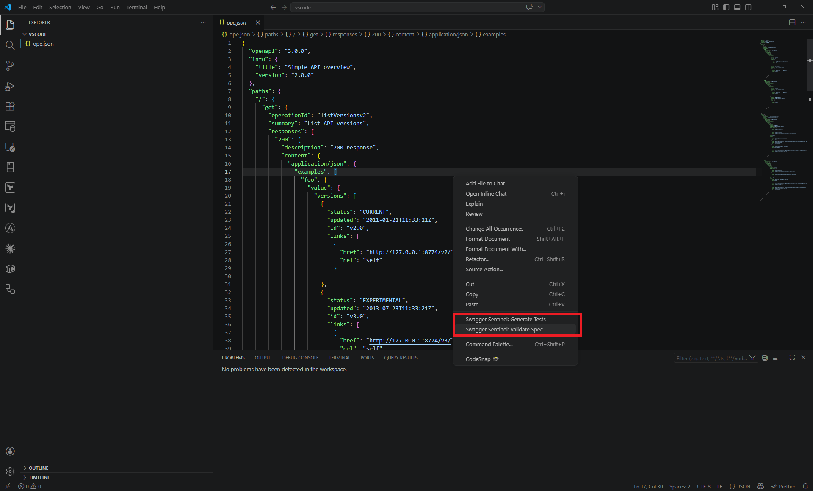

<p align="center">
  
</p>

# swagger-sentinel

Opinionated OpenAPI 3.x validator and test generator with a 130-point checklist.

Available as a **[VS Code Extension](https://marketplace.visualstudio.com/items?itemName=mustafasercansak.swagger-sentinel-vscode)**, **[NPM Package](https://www.npmjs.com/package/swagger-sentinel)**, and **[GitHub Action](https://github.com/marketplace/actions/swagger-sentinel)**.

Despite the name, swagger-sentinel works with any OpenAPI 3.x spec — "Swagger" is just the legacy term that stuck.

## Installation

### VS Code Extension

Search for **"Swagger Sentinel"** in the VS Code Extensions view, or install it from the **[Marketplace](https://marketplace.visualstudio.com/items?itemName=mustafasercansak.swagger-sentinel-vscode)**.

- **Real-time Validation**: Instant feedback as you type.
- **Diagnostics**: Errors and warnings highlighted directly in your editor.
- **Commands**: Generate tests or validate manually via the Command Palette or context menu.



### CLI (NPM)

```bash
npm install -g swagger-sentinel
# or use directly with npx
npx swagger-sentinel validate your-api.yaml
```

## Commands

### Validate

Run the 130-point checklist against your spec:

```bash
swagger-sentinel validate your-api.yaml
swagger-sentinel validate your-api.yaml --strict       # warnings = errors
swagger-sentinel validate your-api.yaml --format json   # CI-friendly output
swagger-sentinel validate your-api.yaml --category paths # validate one category
swagger-sentinel validate your-api.yaml --rules ./rules # load custom rules
```

### Rules Registry

Explore the 130-point checklist directly from your terminal:

```bash
swagger-sentinel rules                 # List all rules by category
swagger-sentinel rules --category security # Filter by category
swagger-sentinel rules P16             # Show details for a specific rule
```

### Generate Tests
 
Generate **TypeScript** Vitest test suites from your spec. Now includes **Faker.js** integration for realistic, schema-driven test data:
 
 ```bash
 swagger-sentinel generate your-api.yaml --output ./tests/
 swagger-sentinel generate your-api.yaml --tag Pets           # specific tag only
 swagger-sentinel generate your-api.yaml --base-url http://localhost:8080
 swagger-sentinel generate your-api.yaml --seed 123          # consistent random data
 ```
 
 The generator automatically maps semantic field names (like `email`, `firstName`, `birthDate`) to realistic mock data.

### AI Enrich (Documentation Auto-Fill)

Automatically detect missing `summary` and `description` fields across your operations and schemas, and fill them in using AI — powered by **Google Gemini** or **OpenAI**:

```bash
# Preview what would be generated (dry run — no file changes)
swagger-sentinel enrich your-api.yaml --provider gemini

# Write AI-generated docs directly back to the file
swagger-sentinel enrich your-api.yaml --provider gemini --write

# Use OpenAI instead of Gemini
swagger-sentinel enrich your-api.yaml --provider openai --write

# Generate documentation in Turkish (defaults to English)
swagger-sentinel enrich your-api.yaml --lang tr --write
```

**Options:**

| Option | Default | Description |
|--------|---------|-------------|
| `--provider` | `gemini` | LLM provider to use (`gemini` or `openai`) |
| `--lang` | `en` | Language for generated docs (e.g. `en`, `tr`, `de`) |
| `--write` | — | Write changes back to the spec file |

**API Key Setup:**

```bash
# For Google Gemini
export GEMINI_API_KEY="your-api-key"

# For OpenAI
export OPENAI_API_KEY="your-api-key"
```

### Watch Mode

Re-validate on every file change:

```bash
swagger-sentinel watch your-api.yaml
swagger-sentinel watch your-api.yaml --strict
```

### Utilities

```bash
swagger-sentinel syntax your-api.yaml    # quick syntax check
swagger-sentinel tags your-api.yaml      # list all operation tags
```

### Spectral Export

Export your sentinel rules to a Spectral-compatible YAML ruleset:

```bash
swagger-sentinel export-spectral > .spectral.yaml
```

## Validation Categories

| Category | Checks | Automated |
|----------|--------|-----------|
| Structure & Metadata | 15 | 11 |
| Path Design | 20 | 13 |
| Operations | 25 | 15 |
| Request Validation | 18 | 12 |
| Response Design | 25 | 12 |
| Security | 15 | 12 |
| Documentation | 12 | 8 |
| **Total** | **130** | **83** |

See [docs/CHECKLIST.md](docs/CHECKLIST.md) for the full checklist.

## GitHub Actions

Swagger Sentinel is available on the [GitHub Marketplace](https://github.com/marketplace/actions/swagger-sentinel). Add it to any workflow to validate your OpenAPI spec on every push or pull request:

```yaml
- name: Validate OpenAPI spec
  uses: mssak/swagger-sentinel@v1   # replace with your published tag
  with:
    spec-path: api.yaml
```

### Inputs

| Input | Required | Default | Description |
|-------|----------|---------|-------------|
| `spec-path` | ✅ | — | Path to the OpenAPI spec file (`.yaml` or `.json`) |
| `strict` | | `false` | Treat warnings as errors |
| `category` | | _(all)_ | Validate only one category (Structure, Paths, Operations, Request, Response, Security, Documentation) |
| `generate-tests` | | `false` | Generate Vitest TypeScript tests from the spec |
| `output-dir` | | `generated-tests` | Output directory for generated tests |
| `base-url` | | `http://localhost:3000` | Base URL used in generated tests |

### Outputs

| Output | Description |
|--------|-------------|
| `passed` | Number of checks that passed |
| `errors` | Number of failed error-level checks |
| `warnings` | Number of failed warning-level checks |
| `suggestions` | Number of failed suggestion-level checks |
| `total` | Total number of checks run |

### Full workflow example

```yaml
name: API Contract
on:
  pull_request:
    paths: ['**/*.yaml', '**/*.json']
jobs:
  validate:
    runs-on: ubuntu-latest
    steps:
      - uses: actions/checkout@v4

      - name: Validate OpenAPI spec
        id: sentinel
        uses: mssak/swagger-sentinel@v1
        with:
          spec-path: api.yaml
          strict: true

      - name: Print summary
        if: always()
        run: |
          echo "Passed   : ${{ steps.sentinel.outputs.passed }}"
          echo "Errors   : ${{ steps.sentinel.outputs.errors }}"
          echo "Warnings : ${{ steps.sentinel.outputs.warnings }}"
          echo "Total    : ${{ steps.sentinel.outputs.total }}"
```

## CI Integration

Swagger Sentinel is built for CI/CD. It natively supports **GitHub Actions Annotations** (to show errors directly on your PR code) and **Job Summaries**.

```yaml
name: API Contract
on:
  pull_request:
    paths: ['specs/**']
jobs:
  validate:
    runs-on: ubuntu-latest
    steps:
      - uses: actions/checkout@v4
      - name: Sentinel Validate
        run: |
          npx swagger-sentinel validate specs/api.yaml \
            --strict \
            --github-annotations \
            --summary results.md
      - name: Upload Summary
        if: always()
        run: cat results.md >> $GITHUB_STEP_SUMMARY
```

The `--github-annotations` flag will automatically highlight issues on the exact lines of your YAML file in the GitHub PR view.

## Custom Rules

You can extend **swagger-sentinel** with your own domain-specific rules. Create a directory (e.g., `./sentinel-rules`) and add `.js` or `.mjs` files:

```javascript
// ./sentinel-rules/no-internal-paths.js
export default function validate(spec) {
  const results = [];
  for (const path in spec.paths) {
    if (path.startsWith('/internal')) {
      results.push({
        id: 'CUSTOM01',
        category: 'Custom',
        severity: 'error',
        passed: false,
        message: `Internal path detected: ${path}`
      });
    }
  }
  return results;
}
```

Then run with the `--rules` flag:
```bash
swagger-sentinel validate api.yaml --rules ./sentinel-rules
```

## Programmatic Usage (TypeScript/ESM)

```typescript
import { loadSpec, validate, generate } from 'swagger-sentinel';

const spec = loadSpec('your-api.yaml');
const results = validate(spec);
const testFiles = generate(spec, { output: './tests' });
```

## Development

If you are contributing to **swagger-sentinel**, use the following scripts:

- **`npm run build`**: Compiles TypeScript (important for updating the `dist/` binary used by `npx`).
- **`npm run validate <file>`**: Runs the validator directly from source (using `tsx`).
- **`npm test`**: Runs the Vitest suite.
- **`npm run build:watch`**: Automatically recompiles on every file change.

> [!IMPORTANT]
> When testing the CLI locally via `npx .`, always run `npm run build` first to ensure the distributed files are up to date!

## Configuration

You can customize **swagger-sentinel** using a `.sentinelrc` file (JSON or YAML) in your project root.

```json
{
  "strict": true,
  "ignore": ["R50", "P15"],
  "overrides": {
    "SEC101": "error",
    "DOC119": "suggestion"
  },
  "generate": {
    "seed": 12345,
    "baseUrl": "https://api.staging.com",
    "output": "./generated-tests"
  }
}
```

### Options
- **`strict`**: Treat warnings as errors (equivalent to `--strict`).
- **`ignore`**: An array of Rule IDs to completely skip during validation.
- **`overrides`**: A map of Rule IDs to their desired severity (`error`, `warning`, or `suggestion`).
- **`generate`**: Default options for the `generate` command.

## License

MIT

 
