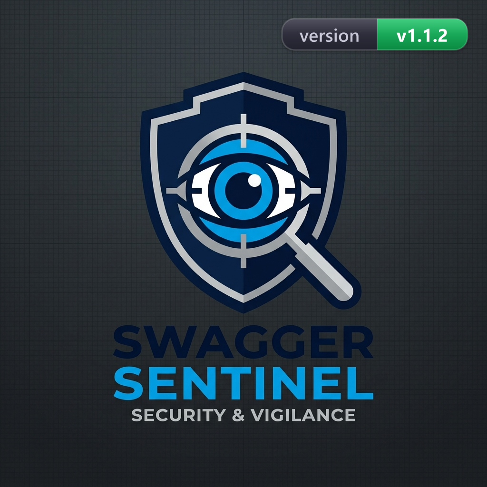
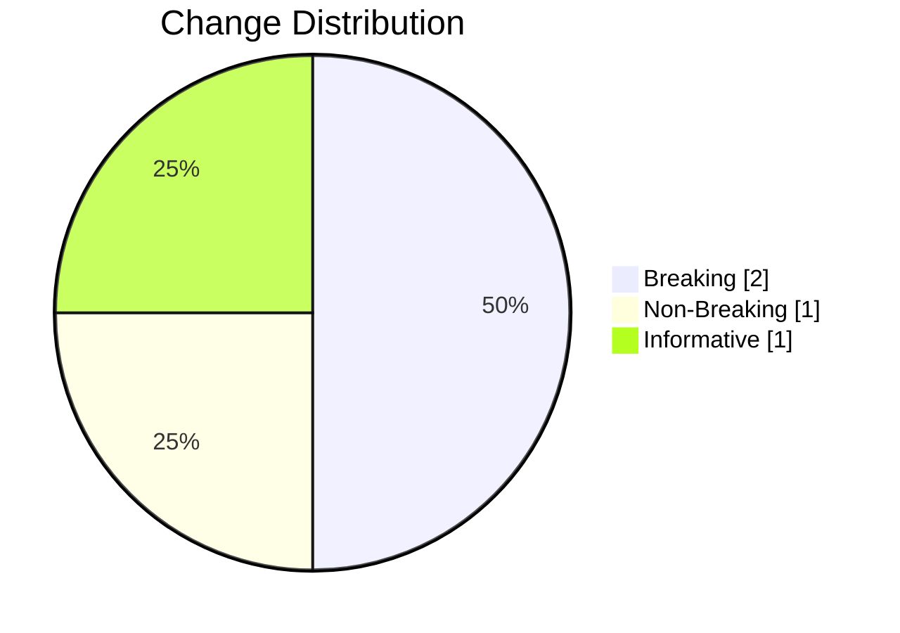

## Swagger Sentinel Breaking Change Summary

### Executive Summary

Breaking changes detected. A MAJOR version bump is recommended before release.

### Release Decision

| Item | Value |
|---|---|
| Release Status |  |
| Risk Status |  |
| Recommended Version Bump | MAJOR |
| Decision Rationale | Breaking changes were detected. Release should be blocked until migration plan and version bump are approved. |

### Context

- Generated At: 2026-04-27T16:03:33.535Z
- Old Spec: docs/examples/breaking-change/old-api.yaml
- New Spec: docs/examples/breaking-change/new-api.yaml

### Metrics

| Metric | Value |
|---|---:|
| Total Changes | 4 |
| Breaking Changes | 2 |
| Non-Breaking Changes | 1 |
| Informative Changes | 1 |
| Recommended Version Bump | MAJOR |
| Risk Score | 24 |
| Risk Level | HIGH () |
| Risk Gauge | HIGH [##################] 160% of HIGH threshold |

### Visual Snapshot

### Risk Configuration

| Parameter | Value |
|---|---:|
| breakingWeight | 10 |
| nonBreakingWeight | 3 |
| informativeWeight | 1 |
| mediumThreshold | 6 |
| highThreshold | 15 |

### Breaking Changes

| # | Scope | Detail |
|---:|---|---|
| 1 | GET /pets | Parameter "limit" is now required |
| 2 | /pets/{petId} | Path /pets/{petId} was removed |

### Non-Breaking Changes

| # | Scope | Detail |
|---:|---|---|
| 1 | /health | New path /health was added |

### Informative Changes

| # | Scope | Detail |
|---:|---|---|
| 1 | GET /pets | operationId changed from "pets_list" to "pets_list_v2" |

### Recommended Actions

- Apply a MAJOR version bump before release and communicate migration notes.
- Review client impact for removed paths/methods and required request changes.
- Verify additive endpoints and fields are reflected in client SDK and docs.
- Confirm operationId/documentation updates are aligned with tooling expectations.
